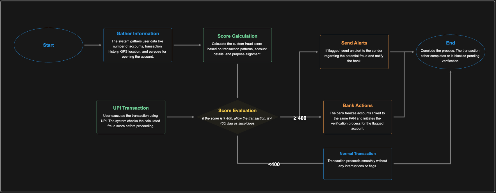

# AntiFraudX

## Team Name and Hackathon
**Team Name**: CodeBusters  
**Hackathon**: Hack4Bengal 4.0

## Acknowledgement
We extend our gratitude to the Hack4Bengal 4.0 organizers for providing this platform to showcase our innovation. Special thanks to Major League Hacking (MLH) for the MongoDB Atlas track, our mentors for their guidance, and our team for their relentless dedication. We also appreciate MongoDB for the student credits that powered our project.

## Introduction
AntiFraudX is a real-time financial fraud prevention system designed to protect banks and account holders. By generating Trust Scores based on transaction patterns, locations, and user behavior, it instantly detects and mitigates fraud. Integrated with MongoDB Atlas, AntiFraudX uses rule-based transaction monitoring to flag suspicious activities like unusual amounts or high-frequency transactions, ensuring proactive fraud prevention. Our solution aligns with the MLH Best Use of MongoDB Atlas track, leveraging its scalability and low-latency for real-time analytics.

## YouTube Video
[Watch our project demo here](https://www.youtube.com/watch?v=your-video-id)  
*Note*: Please replace `https://www.youtube.com/watch?v=your-video-id` with the actual YouTube video link in the repository.

## Workflow
The following diagram illustrates the real-time fraud prevention process of AntiFraudX:

*Note*: To create the workflow image, use a tool like draw.io or Lucidchart to depict the flow: Transaction → Data Ingestion → Rule-Based Checks (Amount, Frequency, Location, Device) → Trust Score Update → Action (Block/Flag/Approve) → Bank Dashboard/Notification. Save the image as `workflow.png` and upload it to the `images` folder in your GitHub repository.

## Tech Stacks
- **Backend**: Python, Flask
- **Database**: MongoDB Atlas
- **Real-Time Processing**: MongoDB Change Streams
- **Frontend**: HTML, CSS, JavaScript
- **Deployment**: Heroku
- **Tools**: Git, Postman

## Future Scope
- Integrate machine learning for advanced anomaly detection.
- Add behavioral biometrics for enhanced user authentication.
- Implement adaptive authentication for high-risk transactions.
- Expand to multi-bank ecosystems with API integrations.
- Optimize for global scalability with microservices architecture.

## Links
- [GitHub Repository](https://github.com/CodeBusters/AntiFraudX)
- [MongoDB Atlas](https://www.mongodb.com/atlas)
- [Hack4Bengal 4.0](https://hack4bengal.org)
- [Project Presentation](https://docs.google.com/presentation/d/placeholder)